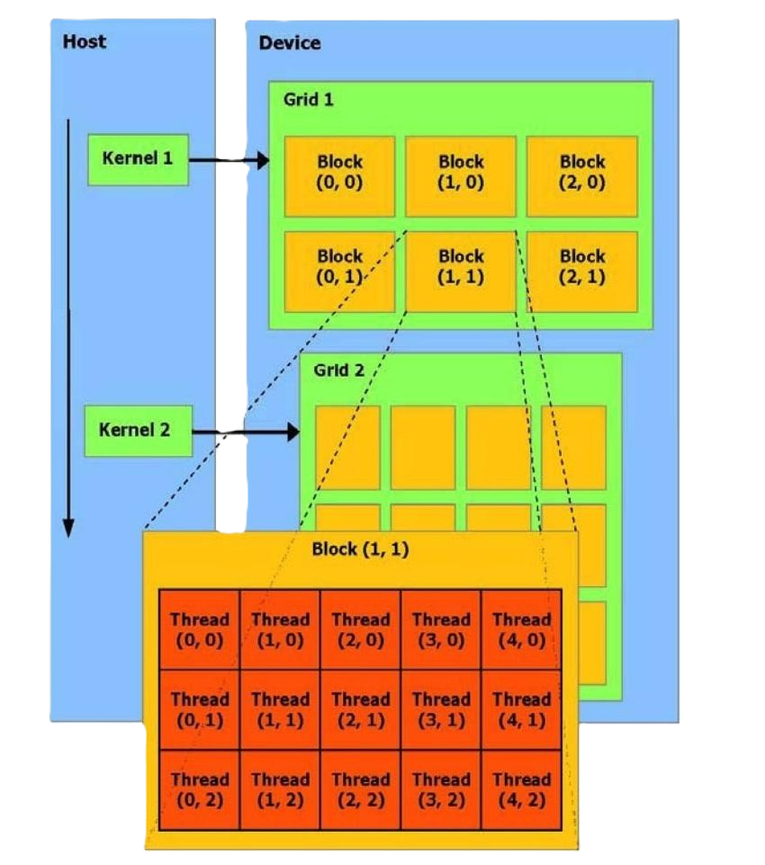
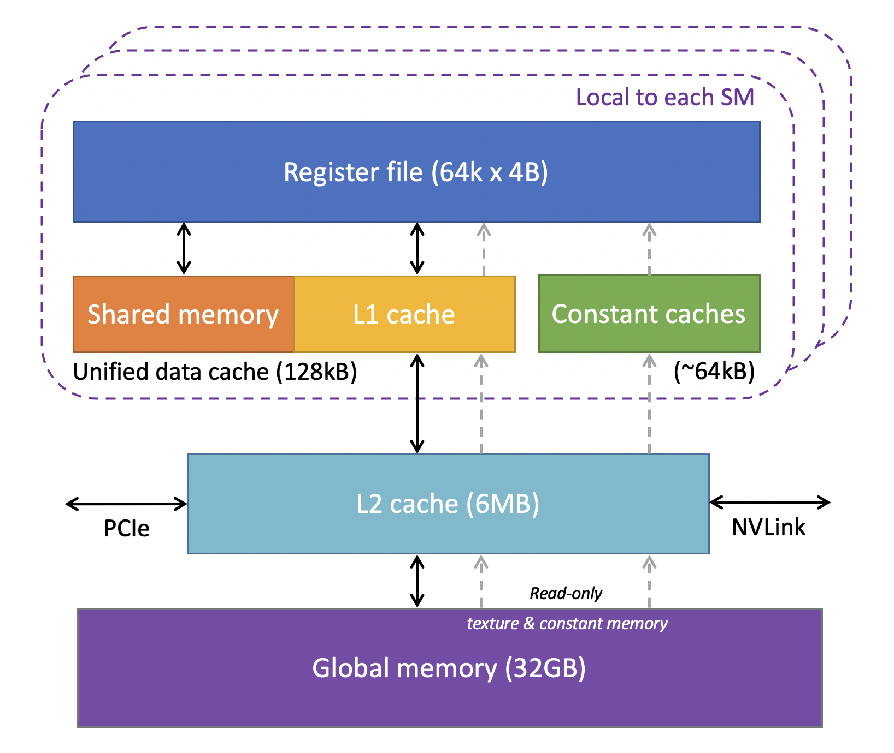
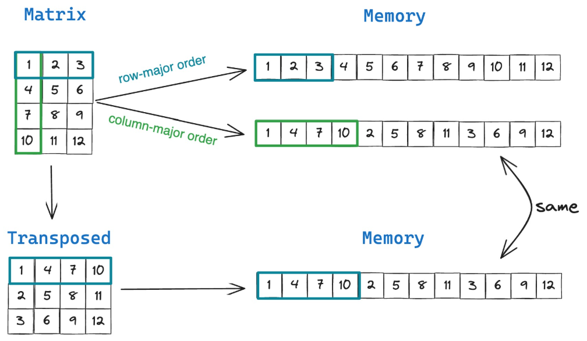
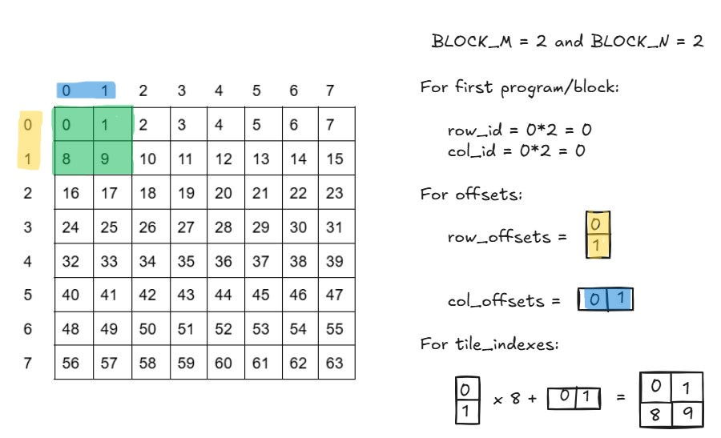
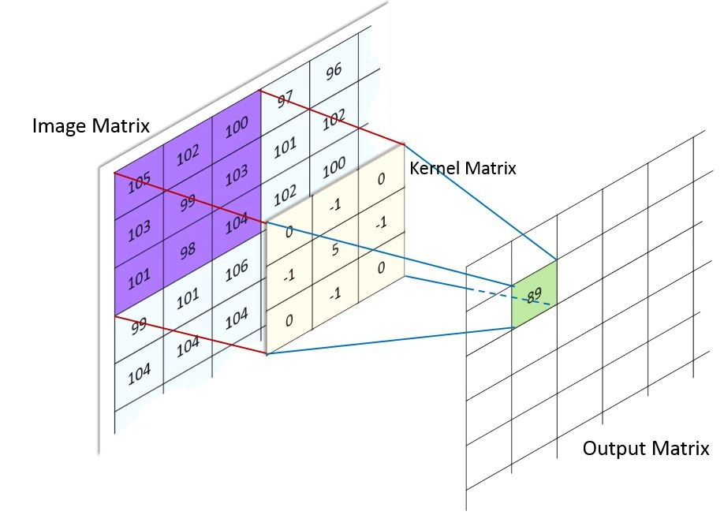
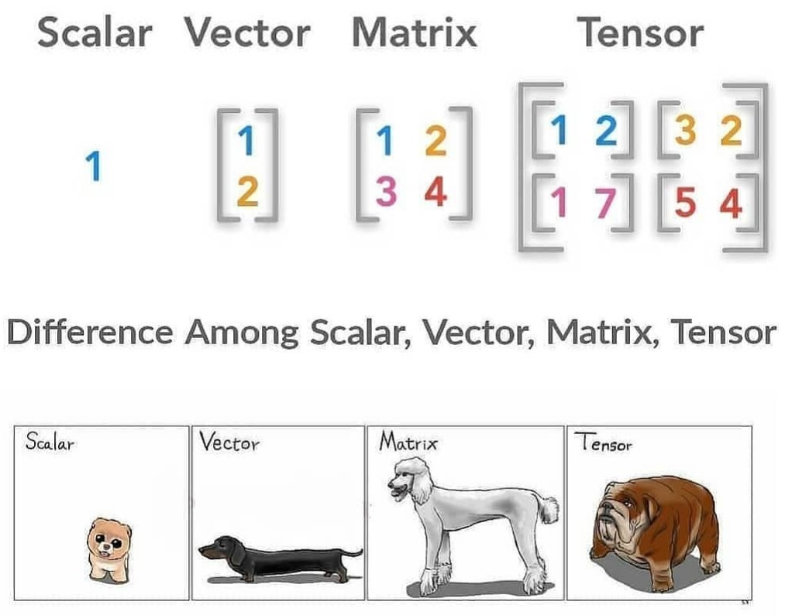
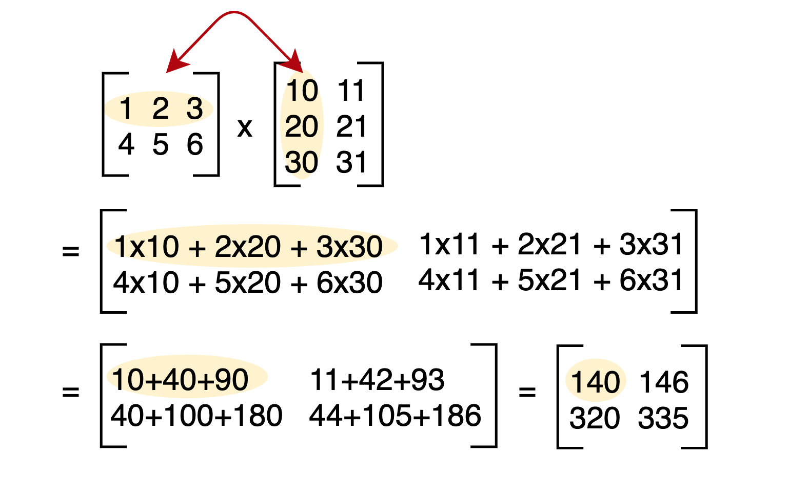
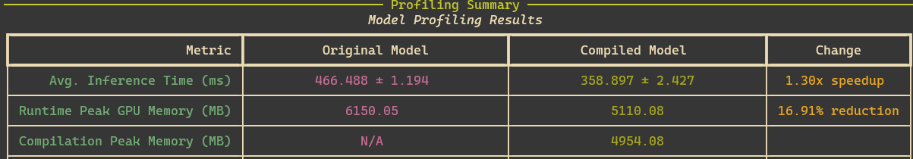
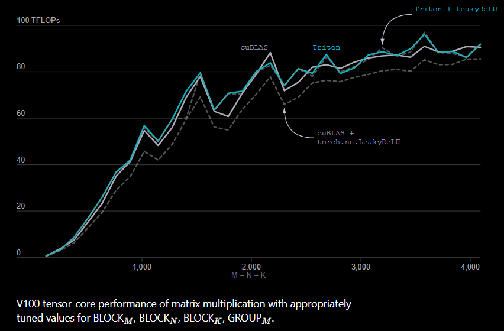

What We'll Accomplish Today
===

## 🎯 **Core Goal**
Write custom, high-performance GPU kernels for vector, matrix, and image operations from scratch.

---
<!-- incremental_lists: true -->
### 🧠 **Learning Outcomes:**
- **Understand** Triton's core programming model (programs, blocks, vectors).
- **Implement** kernels for addition, matrix multiplication, and convolution.
- **Master** essential Triton concepts like loading, storing, offsets, and masking.
- **Learn** to reason about GPU performance and memory access patterns.

<!-- end_slide -->

Workshop Outline
===
<!-- new_lines: 6 -->
<!-- column_layout: [1, 4, 1] -->
<!-- column: 1 -->
## 📋 **Session Outline**

| ⏰ Time | 📚 Session | 🛠️ What We Cover
|:---:|:---|:---|
| **0:00-0:10** | 🏁 **Intro & Motivation** | Why use Triton over PyTorch/CUDA? |
| **0:10-0:20** | 🧠 **Core Concepts** | The Triton vs. CUDA programming model |
| **0:30-0:50** | ➕ **Part 1: Vector Addition** | Your first 1D kernel |
| **0:50-1:30** | 🖼️ **Part 2: Image Manipulation** | Handling 2D data |
| **1:30-1:45** | ☕ **Break / Q&A** | |
| **1:45-2:30** | 🎨 **Part 3: Image Ops & Convolution** | Setting up for complex 3D operations |
| **2:30-3:00** | ❎ **Part 4: Matrix Multiplication** | The capstone project |
|| 📈 **Workshop End** | Further learning |
<!-- reset_layout -->

<!-- end_slide -->

Why Custom Kernels? The Performance Problem
===

## ⚠️ **Why Not Just Use PyTorch?**

### **Standard PyTorch:**
```python +line_numbers {1-3|1-4|1-6}
# A common pattern in a custom activation or normalization layer
def custom_op(a, b, c):
    x = a * b       # Kernel 1: Elem-wise multiplication
    y = x + c       # Kernel 2: Elem-wise addition
    z = torch.sqrt(y) # Kernel 3: Elem-wise sqrt
    return z
```

<!-- pause -->

### **🔴 The Hidden Cost:**
- 🐌 **Memory Bound:** Each line reads from and writes to slow GPU global memory (DRAM).
- 💔 **No Kernel Fusion:** PyTorch launches three separate kernels, creating overhead. The GPU isn't doing useful work between launches.
- 📉 **Underutilization:** For element-wise ops, the GPU spends more time waiting for data than computing.

<!-- pause -->

### **✅ Triton's Solution:** 
**A single, fused GPU kernel that reads inputs once, computes everything in fast registers, and writes the final result once.**

<!-- end_slide -->

Triton vs. CUDA: A Different Kernel Approach
===

## 🚀 **The Programming Model Shift**

<!-- column_layout: [1, 1] -->
<!-- column: 0 -->

### 🔧 **CUDA: Scalar-Focused**
*You manage individual **threads**.*

<!-- pause -->
- **Mental Model:** A huge army of tiny workers (threads). You tell each one exactly what to do.
- **Your Code:** Operates on single scalars. `result = a[i] + b[i]`.
- **Your Job:** Manually manage shared memory, thread synchronization (`__syncthreads()`), and memory access patterns to avoid bank conflicts.
- **Power:** Absolute control for maximum performance, if you are an expert.
- **Complexity:** High, C++ compilation, no debugging inside kernel.  

<!-- column: 1 -->
<!-- pause -->

### ✨ **Triton: Vector-Focused**
*You manage groups of operations, or **programs**.*

<!-- pause -->
- **Mental Model:** A team of highly competent managers (programs). You give each one a large chunk of work (a block).
- **Your Code:** Operates on vectors/blocks of data. `result_block = tl.load(a_ptr) + tl.load(b_ptr)`.
- **Triton's Job:** The compiler automatically manages shared memory, schedules instructions, and optimizes memory access.
- **Power:** High-level abstractions lead to portable, readable, and often near-peak performance code.
- **Complexity:** Lower, pythonic with debugging options.  
- N.B. CUDA *Block* === Triton *Program*
<!-- reset_layout -->

<!-- pause -->

<!-- column_layout: [4,1] -->
<!-- column: 0 -->

<!-- reset_layout -->
<!-- end_slide -->

The Model in Action: Vector Addition
---

Let's add two vectors `x` and `y` of size 6, using a `BLOCK_SIZE` of 4. This requires `ceil(6/4) = 2` programs/blocks.

<!-- column_layout: [1, 1] -->
<!-- column: 0 -->
### **CUDA Approach (Threads)**

A grid of 2 blocks, each with 4 threads. Each thread computes **one scalar element**.

- **Block 0, Thread 0:** `z[0] = x[0] + y[0]`
- **Block 0, Thread 1:** `z[1] = x[1] + y[1]`
- **Block 0, Thread 2:** `z[2] = x[2] + y[2]`
- ...
- **Block 1, Thread 2:** `if (offset < 6)` does nothing.
- **Block 1, Thread 3:** `if (offset < 6)` does nothing.
  
<!-- column: 1 -->
### **Triton Approach (Programs)**

A grid of 2 programs. Each program computes **one block of vector elements**.  
***NO CONTROL OVER THREADS***

- **Program 0:**
  - `offs = [0, 1, 2, 3]`
  - `mask = [T, T, T, T]`
  - `x_vals = tl.load(x_ptr + offs, mask)`
  - `...`
- **Program 1:**
  - `offs = [4, 5, 6, 7]`
  - `mask = [T, T, F, F]`
  - `x_vals = tl.load(x_ptr + offs, mask)`
  - ...
  
<!-- reset_layout -->
<!-- end_slide -->

Refresing GPU Memory layout
===
<!-- column_layout: [1, 1] -->
<!-- column: 0 -->

<!-- column: 1 -->

<!-- reset_layout -->

<!-- end_slide -->
<!-- jump_to_middle -->
PART 1: VECTOR ADDITION
===
<!-- end_slide -->

Triton Kernel Anatomy
---

Let's break down a simple kernel that copies a vector. All 1D kernels follow this exact pattern.
All triton kernels need the `@triton.jit` decorator.  
[Triton JIT Docs](https://triton-lang.org/main/python-api/triton.html)  
[Triton Language Docs](https://triton-lang.org/main/python-api/triton.language.html)  

```python {1-4|1-7|1-12|1-16|1-19|1-22} +line_numbers
import triton
import triton.language as tl

@triton.jit
def copy_kernel(x_ptr, z_ptr, n_elements, BLOCK_SIZE: tl.constexpr):
    # 1. Get Program ID (which chunk of work am I?)
    pid = tl.program_id(axis=0)

    # 2. Calculate offsets for this program
    # This creates a vector like [0, 1, ..., 1023] and shifts it by the block start
    block_start = pid * BLOCK_SIZE
    offsets = block_start + tl.arange(0, BLOCK_SIZE)

    # 3. Create a mask to prevent out-of-bounds access
    # This is crucial for correctness when n_elements is not a multiple of BLOCK_SIZE
    mask = offsets < n_elements

    # 4. LOAD a block of data safely
    x = tl.load(x_ptr + offsets, mask=mask)
    # Maybe do something with x - COMPUTE
    # 5. STORE the block of data safely
    tl.store(z_ptr + offsets, x, mask=mask)
```
<!-- column_layout: [2, 1, 1] -->
<!-- column: 1 -->
<!-- pause -->
## LOAD
<!-- pause -->
## COMPUTE
<!-- pause -->
## STORE
<!-- reset_layout -->
<!-- end_slide -->

Triton Kernel Anatomy
---

<!-- new_lines: 6 -->
Triton kernels can call other functions **as long as those are `@triton.jit` decorated.**

```python {1-5|2,6-15} +line_numbers
@triton.jit
def func_to_call(x_ptr, ...):
    ...
    return x * 2

@triton.jit
def kernel_with_func(x_ptr, ...):
    ...
    y = func_to_call(x_ptr, ...)
    ...
```
<!-- end_slide -->

The Launcher: Calling Your Kernel from Python
---

A Triton kernel needs a *regular Python function* to launch it.

```python +line_numbers +exec {1-10|4|1-17}
/// import os
/// import torch
/// import triton
/// import triton.language as tl
/// @triton.jit
/// def copy_kernel(x_ptr, z_ptr, n_elements, BLOCK_SIZE: tl.constexpr):
///     # 1. Get Program ID (which chunk of work am I?)
///     pid = tl.program_id(axis=0)
/// 
///     # 2. Calculate offsets for this program
///     # This creates a vector like [0, 1, ..., 1023] and shifts it by the block start
///     block_start = pid * BLOCK_SIZE
///     offsets = block_start + tl.arange(0, BLOCK_SIZE)
/// 
///     # 3. Create a mask to prevent out-of-bounds access
///     # This is crucial for correctness when n_elements is not a multiple of BLOCK_SIZE
///     mask = offsets < n_elements
/// 
///     # 4. Load a block of data safely
///     x = tl.load(x_ptr + offsets, mask=mask)
///     
///     # 5. Store the block of data safely
///     tl.store(z_ptr + offsets, x, mask=mask)
# def copy_kernel(...):
#    ...
def copy(x: torch.Tensor):
    z = torch.empty_like(x).cuda() # Prepare output tensor
    n_elements = x.numel()
    # Define the grid: how many programs to launch?
    block_size = 512
    grid = (triton.cdiv(n_elements, block_size),) # 1D program tuple
    # Launch the kernel. The grid is passed in square brackets.
    copy_kernel[grid](x, z, n_elements, BLOCK_SIZE=1024)
    return z

tensor_x = torch.randn(5000).cuda()
copied_tensor = copy(tensor_x)
/// grid = (triton.cdiv(5000, 512),)
print(f"Launched {grid} programs.")
print(f"Tensors are same object: {tensor_x is copied_tensor}")
print(f"Tensor contents copied: {torch.allclose(tensor_x, copied_tensor)}")
```
<!-- incremental_lists: true -->
- `grid` can be a tuple `(n_blocks, m_blocks, )` or a lambda. The lambda is useful for *auto-tuning*, as it gets access to kernel meta-parameters (e.g. `BLOCK_SIZE`).
- `triton.cdiv(a, b)` is ceiling division: `(a + (b - 1)) // b`.

<!-- end_slide -->

Live Debugging with `TRITON_INTERPRETER`
===

Setting the `TRITON_INTERPRETER=1` env var runs your kernel on the CPU, allowing you to use standard Python debugging tools like `print()`.  
Let's introduce a common bug and use print statements to find it.

```python +exec +line_numbers
/// from triton_workshop.utils_debug import ceiling_divide, print_if, check_tensors_gpu_ready
/// import torch
/// import triton
/// import triton.language as tl
/// def add_vectors(x, y, kernel_fn):
///     # Validate tensors are ready for computation
///     check_tensors_gpu_ready(x, y)
///     output = torch.empty_like(x)
///     n_elements = output.numel()
///     grid = lambda meta: (ceiling_divide(n_elements, meta["BLOCK_SIZE"]),)
///     kernel_fn[grid](x, y, output, n_elements, BLOCK_SIZE=4)
///     return output
@triton.jit
def buggy_add_kernel(x_ptr, y_ptr, out_ptr, n_elements, BLOCK_SIZE: tl.constexpr):
    pid = tl.program_id(axis=0)
    offsets = tl.arange(0, BLOCK_SIZE)
    mask = offsets < n_elements
    # Print debug info for first few program instances
    print_if(f"DEBUG: pid={pid}, offsets={offsets}", pid_0=[pid])
    x = tl.load(x_ptr + offsets, mask=mask, other=0.0)
    y = tl.load(y_ptr + offsets, mask=mask, other=0.0)
    tl.store(out_ptr + offsets, x + y, mask=mask)

# Note: Using CPU tensors for this example since TRITON_INTERPRET=1 is set
x = torch.arange(0.0, 10.0)
y = torch.ones(10)
output_buggy = add_vectors(x, y, buggy_add_kernel) # Block size of 4
print(f"\nExpected output: {[float(f'{i + 1:.1f}') for i in range(10)]}")
print(f"Actual output:   {output_buggy.tolist()}")
```
<!-- pause -->
The print output shows all programs (`pid=0`, `pid=1` and `pid=2`) are computing with the exact same offsets `[0, 1, 2, 3]`.  
This is why only the first program was correct, each other program just accessed the same data. 

<!-- end_slide -->

Live Debugging: The Fix
===

Now, let's correct the offset calculation and see the difference.  
**The Bug:** We forgot to use the `pid` to calculate our offsets!  
<!-- pause -->
**The Fix:** We re-introduce `block_start = pid * BLOCK_SIZE` to correctly position each program's work.

```python +exec +line_numbers {1-3|4|5|1-22}
/// from triton_workshop.utils_debug import ceiling_divide, print_if, check_tensors_gpu_ready
/// import torch
/// import triton
/// import triton.language as tl
/// from rich import print
/// def add_vectors(x, y, kernel_fn):
///     # Validate tensors are ready for computation
///     check_tensors_gpu_ready(x, y)
///     output = torch.empty_like(x)
///     n_elements = output.numel()
///     grid = lambda meta: (ceiling_divide(n_elements, meta["BLOCK_SIZE"]),)
///     kernel_fn[grid](x, y, output, n_elements, BLOCK_SIZE=4)
///     return output
@triton.jit
def add_kernel(x_ptr, y_ptr, out_ptr, n_elements, BLOCK_SIZE: tl.constexpr):
    pid = tl.program_id(axis=0)
    block_start = pid * BLOCK_SIZE
    offsets = block_start + tl.arange(0, BLOCK_SIZE)
    mask = offsets < n_elements
    # Print debug info for first few program instances
    print_if(f"DEBUG: pid={pid}, offsets={offsets}", pid_0=[pid])
    print_if(f"DEBUG: mask for pid {pid} = {mask}", pid_0=[pid])
    x = tl.load(x_ptr + offsets, mask=mask, other=0.0)
    y = tl.load(y_ptr + offsets, mask=mask, other=0.0)
    tl.store(out_ptr + offsets, x + y, mask=mask)

x = torch.arange(0.0, 10.0)
y = torch.ones(10)
output_fixed = add_vectors(x, y, add_kernel)
print(f"\nExpected output: {[float(f'{i + 1:.1f}') for i in range(10)]}")
print(f"Actual output:   {output_fixed.tolist()}")
```
<!-- end_slide -->

WORKSHOP SETUP
===
<!-- column_layout: [1,4,1] -->

<!-- column: 1 -->
**1: Install UV**  
**Linux/Mac** `curl -LsSf https://astral.sh/uv/install.sh | sh`  
**Windows** `powershell -ExecutionPolicy ByPass -c "irm https://astral.sh/uv/install.ps1 | iex"`  
  
**2: Repo** `git clone https://github.com/id-b3/triton-workshop && cd triton-workshop`  

**3: Setup**
```bash +exec
uv run setup-check
```
<!-- pause -->
*You can also install with `pip install -e .`*
<!-- reset_layout -->
<!-- end_slide -->

Exercise 1: Vector Addition
===

## 🏋️ **Your Turn: Implement Vector Addition**

### **📝 Your Task:**
Complete the `add_kernel` below.  
The structure is identical to the copy kernel, but you need to load from two input pointers (`x_ptr`, `y_ptr`) and add the results before storing.  
Find the starting code in *exercises/exercise_1.py* and run with `uv run exercises/exercise_1.py`.

### **🎯 Template to Complete:**
```python
@triton.jit
def add_kernel(x_ptr, y_ptr, output_ptr, n_elements,
               BLOCK_SIZE: tl.constexpr):
    # 1. Get program ID
    pid = tl.program_id(axis=0)
    
    # 2. Calculate offsets for this block
    # TODO: ...
    
    # 3. Create a mask to guard memory access
    # TODO: ...

    # 4. Load x and y vectors safely using the mask
    # TODO: x = ...
    # TODO: y = ...
    
    # 5. Compute the element-wise sum
    # TODO: output = ...

    # 6. Store the result
    # TODO: ...
```
<!-- incremental_lists: true -->
- Compare your implementation against the provided solution in `solutions/exercise_1.py`  
- *P.S. Run your scripts with `uv run my_script.py`*

<!-- end_slide -->

PART 2: WORKING WITH 2D DATA
===

# Simple Image Manipulation
## Key Concepts towards Matrix Multiplication

### This grayscale example introduces two new essential concepts needed for matrix multiplication:  
1. **2D Indexing:** Converting between 2D coordinates (row, col) and linear memory offsets
2. **Broadcasting:** Using `[:, None]` and `[None, :]` to create 2D index grids
3. **Different Input/Output Shapes**

<!-- end_slide -->

ACCESSING DATA FROM A 2D MATRIX
===

# Memory is linear.
# Everything is offsets.
# Nothing is forbidden.


<!-- end_slide -->

ACCESSING DATA FROM A 2D MATRIX
===

To process a 2D matrix, we launch a 2D grid of programs. Each program is responsible for a 2D block (or tile) of the output matrix.

```python
# A 2D grid for an M x N output matrix
grid = (triton.cdiv(M, BLOCK_M), triton.cdiv(N, BLOCK_N))

# Inside the kernel, get 2D program IDs
pid_m = tl.program_id(axis=0) # Row-block ID
pid_n = tl.program_id(axis=1) # Column-block ID
```

We then create 2D offsets using broadcasting, similar to NumPy.
# Calculating 2D offsets

<!-- column_layout: [1, 1] -->
<!-- column: 0 -->

<!-- column: 1 -->
<!-- pause -->
## Use BROADCASTING to create 2D grids of offsets
<!-- reset_layout -->
<!-- new_lines: 4 -->
<!-- pause -->
## Each colour channel is the "next" array - to access multiply the whole offset by channel * height * width (R=0, G=1, B=2)

<!-- end_slide -->

Live offset example
===
```python +exec_replace
import numpy as np
height, width = 4, 7
arr = np.arange(7*4).reshape(height, width)
/// print(f"Starting array:\n {arr}\n")
```
```python +line_numbers +exec {1-2|1-4|1-5}
/// import numpy as np
/// height, width = 4, 7
/// arr = np.arange(7*4).reshape(height, width)
off_h = np.array([2,3])
off_w = np.array([4,5])
off_h = off_h[:, None]  # Shape (2, 1)
/// print(f"Height offset indixes:\n {off_h}\n")
off_w = off_w[None, :]  # Shape (1, 2)
/// print(f"Width offset indixes:\n {off_w}\n")
off = width * off_h + off_w  # Broadcasting to shape (2, 2)
/// print(f"Combined offsets:\n {off}\n")
```
<!-- end_slide -->

Applying 2D Kernels: Greyscale Conversion
---

<!-- incremental_lists: true -->
A simple greyscale filter is a great way to try accessing 2D data.
## Steps:
1. Load the R, G, and B channels as separate 2D blocks
2. Apply a weighted sum
3. Store the 2D result

```python +line_numbers {1-3|1-7|1-12|1-17|1-20|1-25}
@triton.jit
def rgb2grey_k(x_ptr, out_ptr, h, w,
              BS_H: tl.constexpr, BS_W: tl.constexpr):
    # 2D grid of programs
    pid_h, pid_w = tl.program_id(0), tl.program_id(1)

    # Create 2D offsets and mask
    offs_h = pid_h * BS_H + tl.arange(0, BS_H)[:, None]
    offs_w = pid_w * BS_W + tl.arange(0, BS_W)[None, :]
    mask = (offs_h < h) & (offs_w < w)

    offs_2d = offs_h * w + offs_w

    # Load R, G, B channels - it's all about the offsets
    r = tl.load(x_ptr + 0 * (height * width) + offs_2d, mask=mask)
    g = tl.load(x_ptr + 1 * (height * width) + offs_2d, mask=mask)
    b = tl.load(x_ptr + 2 * (height * width) + offs_2d, mask=mask)

    # Luminosity formula greyscale N.B. float operation!
    output = 0.299 * r + 0.587 * g + 0.114 * b

    # Store result
    tl.store(out_ptr + offs_2d, output, mask=mask)
```
<!-- end_slide -->

Example - Image Greyscale Filter
===

<!-- column_layout: [1, 3] -->
<!-- column: 0 -->
# Input

<!-- column: 1 -->
# Output
```python +exec +line_numbers
/// import torch
/// import triton
/// import triton.language as tl
/// from PIL import Image
/// import numpy as np
/// from torchvision import transforms
/// 
@triton.jit
def rgb_to_grayscale_kernel(input_ptr, output_ptr, height, width,
                            BLOCK_SIZE_H: tl.constexpr, BLOCK_SIZE_W: tl.constexpr):
    pid_h = tl.program_id(0)
    pid_w = tl.program_id(1)
    # ...
///     h_offsets = pid_h * BLOCK_SIZE_H + tl.arange(0, BLOCK_SIZE_H)[:, None]
///     w_offsets = pid_w * BLOCK_SIZE_W + tl.arange(0, BLOCK_SIZE_W)[None, :]
///     mask = (h_offsets < height) & (w_offsets < width)
///     hw_offset = h_offsets * width + w_offsets
///     r = tl.load(input_ptr + 0 * (height * width) + hw_offset, mask=mask, other=0.0)
///     g = tl.load(input_ptr + 1 * (height * width) + hw_offset, mask=mask, other=0.0)
///     b = tl.load(input_ptr + 2 * (height * width) + hw_offset, mask=mask, other=0.0)
///     gray = 0.299 * r + 0.587 * g + 0.114 * b
///     tl.store(output_ptr + hw_offset, gray, mask=mask)
def rgb_to_grayscale(image_path):
    img = Image.open(image_path).convert('RGB')
    image_tensor = transforms.ToTensor()(img).cuda().contiguous()
///     channels, height, width = image_tensor.shape
///     print(f"Processing image of shape: {image_tensor.shape} and dtype: {image_tensor.dtype}")
///     output = torch.empty(height, width, device='cuda', dtype=image_tensor.dtype)
    BLOCK_SIZE_H, BLOCK_SIZE_W = 16, 32
///     grid = (triton.cdiv(height, BLOCK_SIZE_H), triton.cdiv(width, BLOCK_SIZE_W))
///     print(f"Using a Triton grid of {grid} programs.")
///     rgb_to_grayscale_kernel[grid](image_tensor, output, height, width,
///                                    BLOCK_SIZE_H=BLOCK_SIZE_H, BLOCK_SIZE_W=BLOCK_SIZE_W)
///     gray_numpy = (output.cpu().numpy() * 255).astype(np.uint8)
///     print(f"Output image shape: {gray_numpy.shape}, dtype: {gray_numpy.dtype}")
///     gray_img = Image.fromarray(gray_numpy)
///     gray_img.show()
rgb_to_grayscale('./poseidon_triton.jpeg')
```
<!-- reset_layout -->
<!-- end_slide -->

Exercise 2: Sepia Filter
===

## 🏋️ **Your Turn: Implement a Sepia Filter**
Complete the `sepia_kernel` below.  
It's similar to the greyscale kernel, but uses a different weighted sum for R, G, and B channels.  
HINT: The output needs to also be an RGB image...  
Find the starting code in *exercises/exercise_2.py* and run with `uv run exercises/exercise_2.py`.
#### Sepia Filter - don't forget to clip! Access common operations from triton.language
``` python
    r_sepia = tl.minimum(0.393 * r + 0.769 * g + 0.189 * b, 1.0)
    g_sepia = tl.minimum(0.349 * r + 0.686 * g + 0.168 * b, 1.0)
    b_sepia = tl.minimum(0.272 * r + 0.534 * g + 0.131 * b, 1.0)
```

### **🎯 Template to Complete:**
```python +line_numbers
@triton.jit
def sepia_kernel(x_ptr, output_ptr, height, width,
               BLOCK_SIZE_H: tl.constexpr, BLOCK_SIZE_W: tl.constexpr):
    # 1. Get program ID(s) ...
    pid_0 = tl.program_id(axis=0)
    pid_1 = tl.program_id(axis=1)
    
    # 2. Calculate offsets for this block
    # 3. Create a mask to guard memory access
    # 4. Load pixels safely using the mask
    # TODO: r = tl.load(...
    
    # 5. Compute the sepia transformation
    # R = minimum ... 

    # 6. Store the result
    # TODO: ...
```
<!-- incremental_lists: true -->
- Compare your implementation against the provided solution in `solutions/exercise_2.py`  
- *P.S. Run your scripts with `uv run my_script.py`*
<!-- end_slide -->

PART 3: IMAGE OPS & CONVOLUTION
===
# Understanding 2D Convolution
Convolution is the fundamental operation of CNNs. It's a sliding window multiply-accumulate operation.

<!-- column_layout: [3, 1] -->
<!-- column: 0 -->

<!-- new_lines: 4 -->
_Caption: A 3x3 kernel slides over the input image. At each step, it performs an element-wise product with the underlying patch and sums the results to produce one output pixel._
<!-- reset_layout -->

<!-- pause -->
Similar to the greyscale filter, but now we have:
- An `K_size x K_size` kernel
- Each output pixel is a sum over a `K_size x K_size` patch in each channel  

<!-- pause -->
**New things to learn:**
- 3D Triton kernel grid
- Nested loops for matrix over matrix operations
<!-- end_slide -->
Working Example
===

```python +exec {1-3|1-4|1-8|1-17|1-24}
/// import torch
/// import triton
/// import triton.language as tl
/// from PIL import Image
/// import numpy as np
/// from torchvision import transforms
@triton.jit
def conv2d_kernel(input_ptr, output_ptr, conv_kernel_ptr, height, width, kernel_size: tl.constexpr,
                  BLOCK_SIZE_H: tl.constexpr, BLOCK_SIZE_W: tl.constexpr):
    pid_c = tl.program_id(0) # Channel dimension *new*
    pid_h = tl.program_id(1)
    pid_w = tl.program_id(2)
    # ...
///     h_offsets = pid_h * BLOCK_SIZE_H + tl.arange(0, BLOCK_SIZE_H)[:, None]
///     w_offsets = pid_w * BLOCK_SIZE_W + tl.arange(0, BLOCK_SIZE_W)[None, :]
///     mask = (h_offsets < height) & (w_offsets < width)
///     channel_offset = pid_c * height * width # Program and whole chnnel offset
    accumulator = tl.zeros((BLOCK_SIZE_H, BLOCK_SIZE_W), dtype=tl.float32)
    for kernel_h in tl.static_range(kernel_size): # Use triton.lang functions for ranges etc
        for kernel_w in tl.static_range(kernel_size):
            h_input = h_offsets + kernel_h
            w_input = w_offsets + kernel_w
            valid_mask = mask & (h_input >= 0) & (h_input < height) & (w_input >= 0) & (w_input < width)
            input_idx = channel_offset + h_input * width + w_input
            kernel_val = tl.load(conv_kernel_ptr + kernel_h * kernel_size + kernel_w)
            input_val = tl.load(input_ptr + input_idx, mask=valid_mask, other=0.0) # Same as padding with 0.0
            accumulator += input_val * kernel_val # Convolution!

///     output_idx = channel_offset + h_offsets * width + w_offsets
///     tl.store(output_ptr + output_idx, accumulator, mask=mask)
def apply_convolution(image_path, kernel):
    # ...
///     img = Image.open(image_path).convert('RGB')
///     image_tensor = transforms.ToTensor()(img).cuda().contiguous()
///     channels, height, width = image_tensor.shape
///     kernel_tensor = torch.tensor(kernel, dtype=torch.float32, device='cuda').contiguous()
///     kernel_size = kernel_tensor.shape[0]
///     output = torch.empty_like(image_tensor)
/// 
///     BLOCK_SIZE_H, BLOCK_SIZE_W = 16, 16
///     grid = (channels, triton.cdiv(height, BLOCK_SIZE_H), triton.cdiv(width, BLOCK_SIZE_W))
/// 
///     conv2d_kernel[grid](image_tensor, output, kernel_tensor, height, width, kernel_size,
///                         BLOCK_SIZE_H=BLOCK_SIZE_H, BLOCK_SIZE_W=BLOCK_SIZE_W)
/// 
///     output_clamped = torch.clamp(output, 0, 1)
///     conv_numpy = (output_clamped.cpu().permute(1, 2, 0).numpy() * 255).astype(np.uint8)
///     conv_img = Image.fromarray(conv_numpy)
///     conv_img.show()
/// sharpen_kernel = [[ 0, -1,  0],
///                   [-1,  5, -1],
///                   [ 0, -1,  0]]
/// edge_kernel = [[-1, -1, -1],
///                [-1,  8, -1],
///                [-1, -1, -1]]
/// motion_blur_diag = [[1/5, 0, 0, 0, 0],
///                     [0, 1/5, 0, 0, 0],
///                     [0, 0, 1/5, 0, 0],
///                     [0, 0, 0, 1/5, 0],
///                     [0, 0, 0, 0, 1/5]]
/// gaussian_blur_5x5 = [[1/256,  4/256,  6/256,  4/256, 1/256],
///                      [4/256, 16/256, 24/256, 16/256, 4/256],
///                      [6/256, 24/256, 36/256, 24/256, 6/256],
///                      [4/256, 16/256, 24/256, 16/256, 4/256],
///                      [1/256,  4/256,  6/256,  4/256, 1/256]]
apply_convolution('./poseidon_triton.jpeg', sharpen_kernel)
apply_convolution('./poseidon_triton.jpeg', edge_kernel)
apply_convolution('./poseidon_triton.jpeg', gaussian_blur_5x5)
apply_convolution('./poseidon_triton.jpeg', motion_blur_diag)
```
<!-- end_slide -->
Exercise 3: 2D Convolution
===

## 🏋️ **Your Turn: Implement Convolution**
### **📝 Your Task:**
Implement the convolution kernel. This is a challenging exercise that combines all the concepts from the workshop.  
Don't worry about padding; the mask with `other=0.0` handles "valid" convolution automatically.  
Remember - it's all about offsets!  

### **🧪 How to Test:**
- Use the image from 'slides/poseidon_triton.jpeg'
- Create a 3x3 kernel, like a Sobel filter for edge detection.
- Apply your kernel and visualize the output. Does it detect the edges?
<!-- end_slide -->

Exercise 3: 2D Convolution
===
Complete the `conv2d_kernel` below.  
HINT: The output needs to also be an RGB image...  
Find the starting code in *exercises/exercise_3.py* and run with `uv run exercises/exercise_3.py`.
#### Sobel kernels
``` python
x_sobel = [[-1, 0, 1],
           [-2, 0, 2],
           [-1, 0, 1]]
y_sobel = [[ 1,  2,  1],
           [ 0,  0,  0],
           [-1, -2, -1]]
```
```python +line_numbers
@triton.jit
def conv2d_kernel(input_ptr, output_ptr, conv_kernel_ptr, height, width, kernel_size: tl.constexpr,
                  BLOCK_SIZE_H: tl.constexpr, BLOCK_SIZE_W: tl.constexpr):
    # 1. Get program ID(s)
    pid_c = tl.program_id(0) # Channel dimension
    pid_h = tl.program_id(1)
    pid_w = tl.program_id(2)
    
    # 2. Calculate offsets for this block
    # 3. Create a mask to guard memory access
    # 4. Initialize accumulator
    accumulator = tl.zeros((BLOCK_SIZE_H, BLOCK_SIZE_W), dtype=tl.float32)
    for kernel_h in tl.static_range(kernel_size): # Use triton.lang functions for ranges etc
        for kernel_w in tl.static_range(kernel_size):
            # 5. Calculate input offsets for the current kernel position
            # 6. Load input values and kernel value
            # 7. Accumulate the product into the accumulator
    # ...
    tl.store(output_ptr + output_idx, accumulator, mask=mask)
```
<!-- incremental_lists: true -->
- Compare your implementation against the provided solution in `solutions/exercise_3.py`
- *P.S. Run your scripts with `uv run my_script.py`*
<!-- end_slide -->

PART 4: MATRIX MULTIPLICATION
===

<!-- column_layout: [4, 1] -->
<!-- column: 0 -->

<!-- end_slide -->

Refresher
===

<!-- end_slide -->

Planning Ahead
===


<!-- end_slide -->

A Naive Matrix Multiplication Kernel
---

This kernel computes `C = A @ B`. Each program computes one `BLOCK_M x BLOCK_N` tile of `C`.

```python +line_numbers +exec
/// import torch
/// import triton
/// import triton.language as tl
/// 
@triton.jit
def matmul_kernel(A, B, C, M, N, K, stride_am, stride_ak, 
            stride_bk, stride_bn, stride_cm, stride_cn,
           BLOCK_SIZE_M: tl.constexpr, BLOCK_SIZE_N: tl.constexpr, BLOCK_SIZE_K: tl.constexpr):
    pid_m = tl.program_id(0)
    pid_n = tl.program_id(1)
    # rm (resp. rn) denotes a range of indices for rows (resp. col) of C
    # rk denotes a range of indices for columns (resp. rows) of A (resp. B)
    rm = pid_m * BLOCK_SIZE_M + tl.arange(0, BLOCK_SIZE_M)
    rn = pid_n * BLOCK_SIZE_N + tl.arange(0, BLOCK_SIZE_N)
    rk = tl.arange(0, BLOCK_SIZE_K)
///     # the memory addresses of elements in the first block of A and B can be computed using numpy-style broadcasting
///     offs_A = A + (rm[:, None] * stride_am + rk[None, :] * stride_ak)
///     offs_B = B + (rk [:, None] * stride_bk  + rn[None, :] * stride_bn)
///     # initialize and iteratively update accumulator
    acc = tl.zeros((BLOCK_SIZE_M, BLOCK_SIZE_N), dtype=tl.float32)
    for k in range(K, 0, -BLOCK_SIZE_K):
        a = tl.load(offs_A)
        b = tl.load(offs_B)
        acc += tl.dot(a, b)
        # increment pointers so that the next blocks of A and B are loaded during the next iteration
        offs_A += BLOCK_SIZE_K * stride_ak
        offs_B += BLOCK_SIZE_K * stride_bk
///     # fuse leaky ReLU if desired - example of custom kernel
///     # acc = tl.where(acc >= 0, acc, alpha * acc)
///     offs_C = C + (rm[:, None] * stride_cm + rn[None, :] * stride_cn)
///     mask = (rm[:, None] < M) & (rn[None, :] < N)
///     tl.store(offs_C, acc, mask=mask)
/// 
/// def matmul(a, b):
///     assert a.shape[1] == b.shape[0], "Matrix dimensions must agree"
///     assert a.is_cuda and b.is_cuda, "Matrices must be on GPU"
///     assert a.is_contiguous() and b.is_contiguous(), "Matrices must be contiguous"
/// 
///     M, K = a.shape
///     K, N = b.shape
///     c = torch.empty((M, N), device=a.device, dtype=torch.float32)
/// 
///     BLOCK_SIZE_M = 64
///     BLOCK_SIZE_N = 32
///     BLOCK_SIZE_K = 32
/// 
///     grid = (triton.cdiv(M, BLOCK_SIZE_M), triton.cdiv(N, BLOCK_SIZE_N),)
/// 
///     matmul_kernel[grid](
///         a, b, c, M, N, K,
///         a.stride(0), a.stride(1),
///         b.stride(0), b.stride(1),
///         c.stride(0), c.stride(1),
///         BLOCK_SIZE_M=BLOCK_SIZE_M, BLOCK_SIZE_N=BLOCK_SIZE_N, BLOCK_SIZE_K=BLOCK_SIZE_K
///     )
/// 
///     return c

M, N, K = 5012, 15768, 21024
A = torch.randn(M, K, device='cuda', dtype=torch.float32)
B = torch.randn(K, N, device='cuda', dtype=torch.float32)

C_triton = matmul(A, B)
C_torch = torch.matmul(A, B)
/// print(f"A shape: {A.shape}")
/// print(f"B shape: {B.shape}")
/// print(f"C shape: {C_triton.shape}")
/// print(f"C (Triton) dtype: {C_triton.dtype}")
/// print(f"Max difference: {torch.max(torch.abs(C_triton - C_torch)).item():.6f}")
/// print(f"All close: {torch.allclose(C_triton, C_torch, atol=1e-4)}")
```
<!-- end_slide -->

A Naive Matrix Multiplication Kernel - BROKEN?
---

This kernel computes `C = A @ B`. Each program computes one `BLOCK_M x BLOCK_N` tile of `C`.

```python +line_numbers +exec {9|1-20}
/// import torch
/// import triton
/// import triton.language as tl
/// 
@triton.jit
def matmul_kernel(A, B, C, M, N, K, stride_am, stride_ak, 
            stride_bk, stride_bn, stride_cm, stride_cn,
           BLOCK_SIZE_M: tl.constexpr, BLOCK_SIZE_N: tl.constexpr, BLOCK_SIZE_K: tl.constexpr):
///     pid_m = tl.program_id(0)
///     pid_n = tl.program_id(1)
///     # rm (resp. rn) denotes a range of indices for rows (resp. col) of C
///     # rk denotes a range of indices for columns (resp. rows) of A (resp. B)
///     rm = pid_m * BLOCK_SIZE_M + tl.arange(0, BLOCK_SIZE_M)
///     rn = pid_n * BLOCK_SIZE_N + tl.arange(0, BLOCK_SIZE_N)
///     rk = tl.arange(0, BLOCK_SIZE_K)
///     # the memory addresses of elements in the first block of A and B can be computed using numpy-style broadcasting
///     offs_A = A + (rm[:, None] * stride_am + rk[None, :] * stride_ak)
///     offs_B = B + (rk [:, None] * stride_bk  + rn[None, :] * stride_bn)
///     # initialize and iteratively update accumulator
    acc = tl.zeros((BLOCK_SIZE_M, BLOCK_SIZE_N), dtype=tl.float32)
    for k in range(K, 0, -BLOCK_SIZE_K):
        a = tl.load(offs_A)
        b = tl.load(offs_B)
        acc += tl.dot(a, b, allow_tf32=False)
        # increment pointers so that the next blocks of A and B are loaded during the next iteration
        offs_A += BLOCK_SIZE_K * stride_ak
        offs_B += BLOCK_SIZE_K * stride_bk
///     # fuse leaky ReLU if desired - example of custom kernel
///     # acc = tl.where(acc >= 0, acc, alpha * acc)
///     offs_C = C + (rm[:, None] * stride_cm + rn[None, :] * stride_cn)
///     mask = (rm[:, None] < M) & (rn[None, :] < N)
///     tl.store(offs_C, acc, mask=mask)
/// 
/// def matmul(a, b):
///     assert a.shape[1] == b.shape[0], "Matrix dimensions must agree"
///     assert a.is_cuda and b.is_cuda, "Matrices must be on GPU"
///     assert a.is_contiguous() and b.is_contiguous(), "Matrices must be contiguous"
/// 
///     M, K = a.shape
///     K, N = b.shape
///     c = torch.empty((M, N), device=a.device, dtype=torch.float32)
/// 
///     BLOCK_SIZE_M = 64
///     BLOCK_SIZE_N = 32
///     BLOCK_SIZE_K = 32
/// 
///     grid = (triton.cdiv(M, BLOCK_SIZE_M), triton.cdiv(N, BLOCK_SIZE_N),)
/// 
///     matmul_kernel[grid](
///         a, b, c, M, N, K,
///         a.stride(0), a.stride(1),
///         b.stride(0), b.stride(1),
///         c.stride(0), c.stride(1),
///         BLOCK_SIZE_M=BLOCK_SIZE_M, BLOCK_SIZE_N=BLOCK_SIZE_N, BLOCK_SIZE_K=BLOCK_SIZE_K
///     )
/// 
///     return c

M, N, K = 5012, 15768, 21024
A = torch.randn(M, K, device='cuda', dtype=torch.float32)
B = torch.randn(K, N, device='cuda', dtype=torch.float32)

C_triton = matmul(A, B)
C_torch = torch.matmul(A, B)
/// print(f"A shape: {A.shape}")
/// print(f"B shape: {B.shape}")
/// print(f"C shape: {C_triton.shape}")
/// print(f"C (Triton) dtype: {C_triton.dtype}")
/// print(f"Max difference: {torch.max(torch.abs(C_triton - C_torch)).item():.6f}")
/// print(f"All close: {torch.allclose(C_triton, C_torch, atol=1e-4)}")
```
<!-- pause -->
# RESPECT THE DATA TYPES!
# Check original implementations!
<!-- end_slide -->

Exercise 4: Matrix Multiplication
===

## 🏋️ **Your Turn: Implement MatMul**
### **📝 Your Task:**
Complete the `matmul_kernel` below.  
You'll implement a tiled matrix multiplication that processes blocks of the output matrix C = A × B.  
Find the starting code in *exercises/exercise_4.py* and run with `uv run exercises/exercise_4.py`.

### **🎯 Template to Complete:**
```python
@triton.jit
def matmul_kernel(
    a_ptr, b_ptr, c_ptr, M, N, K,
    stride_am, stride_ak, stride_bk, stride_bn, stride_cm, stride_cn,
    BLOCK_SIZE_M: tl.constexpr,
    BLOCK_SIZE_N: tl.constexpr,
    BLOCK_SIZE_K: tl.constexpr
):
    # 1. Get 2D program IDs
    pid_m = tl.program_id(axis=0)
    pid_n = tl.program_id(axis=1)

    # 2. Calculate offsets for this block (hint: you can think of "stride" as "height/width")

    # 3. Initialize accumulator with zeros

    # 4. Loop through K dimension in blocks
    for k_block in range(0, tl.cdiv(K, BLOCK_SIZE_K)):
        # Calculate current K offsets
        # Calculate pointers to A and B blocks
        # Create masks for boundary checking
        # Load blocks from A and B
        # Accumulate dot product

    # 5. Calculate output pointers and mask
    # 6. Store the result
```
<!-- end_slide -->

Performance: The Memory Access Problem
---

The naive kernel is correct, but not as fast as it can be. Why? **Poor data locality.**

<!-- column_layout: [1, 1] -->
<!-- column: 0 -->
<!-- pause -->
### Naive "Row-Major" Order
The default execution order processes blocks row-by-row. When `Program 0` finishes its tile of `C`, `Program 1` starts on the next tile in the same row. `Program 1` needs completely different columns from matrix B, leading to a low L2 cache hit rate.

<!-- column: 1 -->
<!-- pause -->
### Optimized "Grouped" Order
We can tell Triton to execute programs in a different order to maximize data reuse. By processing small *groups* of blocks (e.g., 2x2) at a time, we increase the chance that data loaded for one program (e.g., a tile of B) is still in the L2 cache when a nearby program needs it.

<!-- pause -->
<!-- reset_layout -->


<!-- pause -->
### In reality, matrix multiplication is often optimized at the hardware level due to its importance.  
<!-- pause -->
### Using the metal instructions (e.g. cuBLAS) often beats any manual approaches.  
<!-- pause -->
### I.E. Re-implement as part of more complex kernel e.g. fused-softmax in attention.

<!-- end_slide -->
What's Next? Performance & Auto-Tuning
===

## 📈 **Making Kernels Fast**
Writing a correct kernel is the first step. Making it fast is the second.

### **`@triton.testing.perf_report`**
Triton has a built-in utility to easily benchmark your kernel against other implementations (like PyTorch) across different problem sizes.

### **`@triton.autotune`**
Performance depends heavily on `BLOCK_SIZE`, `num_warps`, etc. Instead of guessing, you can provide a list of configurations, and Triton will benchmark them and automatically pick the fastest one for a given input shape.

```python
@triton.autotune(
    configs=[
        triton.Config({'BM': 64, 'BN': 64, 'BK': 32}, num_warps=4),
        triton.Config({'BM': 128, 'BN': 128, 'BK': 64}, num_warps=8),
        # ... more configs ...
    ],
    key=['M', 'N', 'K'], # Re-tune if these input sizes change
)
@triton.jit
def matmul_kernel_autotuned(...):
    # ...
```
<!-- end_slide -->

Where is Triton Used?
===

## Pytorch
- Torch Compile is the new direction of model optimization in PyTorch, and it uses Triton as a backend for generating fused kernels.

## OpenAI
- Original developers of Triton, their LLMs all run on a mix of optimized Triton and CUDA kernels.

## UnslothAI
- High-performance fine-tuning and inference for large language models using Triton.
- Reduces memory usage and speeds up training.
- Very popular tool.

<!-- new_lines: 2 -->
<!-- column_layout: [3, 1] -->
<!-- column: 0 -->

<!-- new_lines: 2 -->
_Example of an inference improvement in part thanks to Triton kernels using torch.compile()._

<!-- end_slide -->

When to Use Triton
===

# Optimization Steps:
1. **Use `torch.compile()`:**
    * Start by using torch.compile() to optimize your code.
2. **Adapt Your Code:**
    * Rewrite code to be more suitable for torch.compile().
    * E.g., eliminate CUDA graph breaks.
3. **Profile and Identify Bottlenecks:**
    * Find slow parts of your code using profiling tools.
    * Write custom Triton kernels for these parts.
4. **Consider CUDA:**
    * If still not fast enough, write custom CUDA kernels.
    * Note: For maximum performance from the start, you may choose CUDA directly.


<!-- end_slide -->

Workshop Wrap-Up
===

## 🎊 **What You've Learnt**
- ✅ Written **correct and idiomatic** Triton GPU kernels from scratch.
- ✅ Implemented 1D vector addition, 2D image operation, 3D kernels for convolution and 2D matrix multiplication.
- ✅ Learned to handle **1D, 2D and multichannel data** with offsets and masking.

### **🧠 Key Concepts**
- ✅ The difference between **Triton's program/vector model** and CUDA's thread/scalar model.
- ✅ The core pattern of **load -> compute -> store** that defines all kernels.

<!-- end_slide -->

Further Learning & Resources
===

### **Next Steps:**
- **Triton Puzzles:** A fantastic collection of exercises to sharpen your skills, from beginner to expert. [github.com/srush/Triton-Puzzles](https://github.com/srush/Triton-Puzzles)
- **Production Kernels:** [UnSloth](https://github.com/unslothai/unsloth/tree/main/unsloth/kernels) kernels are excellent examples.
- **Official Triton Docs:** Explore advanced topics like reductions, scans, and in-depth tutorials. [triton-lang.org](https://triton-lang.org/)
<!-- end_slide -->

<!-- jump_to_middle -->

Thank You & Q&A
===

# 🙏 **Thank You!**

## **Questions & Discussion**

<!-- end_slide -->
References
===
[Triton](https://triton-lang.org/main/index.html)
[OpenAI Blog](https://openai.com/index/triton/)
[UnSloth](https://github.com/unslothai/unsloth/tree/main/unsloth/kernels)
**Huge** thanks to [Umer Adil](https://www.umerha.com/) for his [excellent lecture](https://github.com/gpu-mode/lectures/tree/main/lecture_014)
[Triton Puzzles](https://github.com/srush/Triton-Puzzles)

